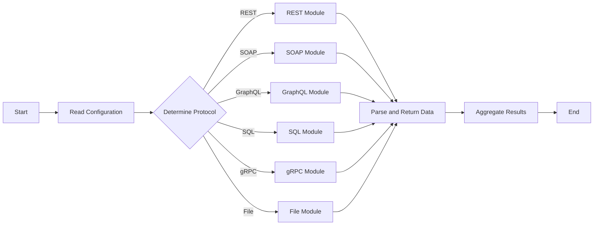

# Agnostic Data Query System

## Project Overview

This system is designed to query various data sources using different protocols such as REST API, SOAP, GraphQL, SQL, gRPC, and file-based scraping. It is highly modular, with each protocol being handled by its own module. All modules implement a common interface, ensuring consistency and interchangeability.

### Key Features

- **Modular Design**: Separate modules for each data source type (REST, SOAP, GraphQL, etc.).
- **Common Interface**: A consistent interface across all modules for initialization, request handling, and response parsing.
- **Configurable**: Uses a YAML configuration file for defining query parameters, including URLs, methods, headers, and specific parsing rules.
- **Concurrent Execution**: Leverages Go's goroutines for concurrent query execution.
- **Extensible**: Easily adaptable to include new data source types.

## System Architecture

Below is a flowchart describing the overall architecture and workflow:



### Data Query Interface

All modules implement the following interface:

```mermaid
```mermaid
classDiagram
    class DataQuery {
        <<interface>>
        +Initialize(config TargetConfig) error
        +MakeRequest() (*ResponseData, error)
        +ParseResponse(rawResponse interface{}) (ParsedData, error)
    }

    DataQuery <|-- RESTQuery
    DataQuery <|-- SOAPQuery
    DataQuery <|-- GraphQLQuery
    DataQuery <|-- SQLQuery
    DataQuery <|-- GRPCQuery
    DataQuery <|-- FileQuery

```

## Configuration

The system uses a YAML file for configuration, allowing detailed specification of each data query. This configuration dictates how the system connects to and interacts with different data sources.

### Configuration Structure

The YAML configuration file includes an array of targets. Each target specifies the data source type and relevant settings.

Example:

```yaml
targets:
  - type: "REST"
    url: "http://example.com/api/user"
    method: "GET"
    headers:
      Accept: "application/json"
    response_type: "json"
    parse_rules:
      id: "userId"
      name: "userName"
    timeout: 5s
    retry_count: 3
    retry_interval: 1s

  - type: "File"
    file_path: "/path/to/local/file.json"
    file_format: "json"

  - type: "SOAP"
    endpoint: "http://example.com/soap"
    // ... other SOAP-specific configs ...

  // ... other targets ...
```

Each target can have protocol-specific parameters such as URLs for REST, file paths for file-based scraping, and endpoints for SOAP. Additionally, common parameters like response type and parsing rules can be specified.

### Target Types and Parameters

- **REST**: URL, method, headers, etc.
- **SOAP**: Endpoint, SOAP action, etc.
- **GraphQL**: URL, query, etc.
- **File**: File path, file format, etc.
- **gRPC**: Server address, method, etc.
- **SQL**: Database connection string, query, etc.

Each type requires its specific set of parameters to be defined in the configuration file.

## Conclusion

The agnostic data query system offers a flexible and efficient way to interact with various data sources, maintaining modularity and extensibility. Its configurable nature allows for easy adaptation to different protocols and data formats.
