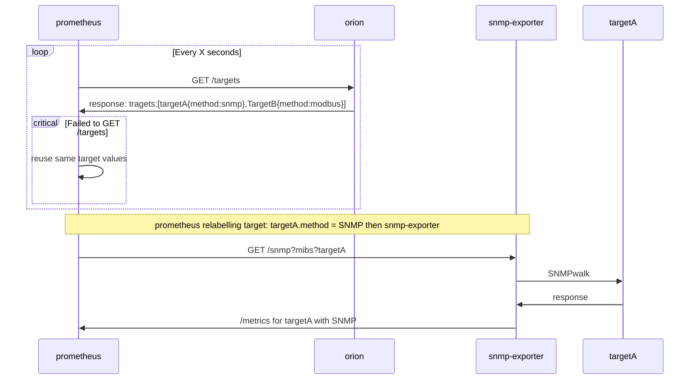

# Orion

## Description

Orion is a web server designed to simplify target configuration for Prometheus.

Prometheus offers powerful service discovery capabilities, but it can be challenging when your resources are not defined in a service discovery method supported natively by Prometheus. This often requires maintaining a static configuration file.

Orion solves this problem by providing a web server that serves a list of targets in a format that Prometheus can understand, using the `http_sd_configs` configuration. With Orion, you can keep your Prometheus configuration static and let it handle the task of serving the targets to Prometheus.

In addition, Orion is designed to be extensible, allowing you to define your modules for retrieving targets.

## TODO

In no particular order:

- [ ] Add a module for retrieving targets from a GLPI instance
- [ ] Add a module for retrieving targets from a phpIPAM instance
- [ ] Add a module for retrieving targets from a Netbox instance
- [ ] Add a module for retrieving targets from a Consul instance
- [ ] Add a customizable module for retrieving targets from a not-supported remote source
- [x] Add a module for retrieving targets from a local file
- [ ] Enable remote cache usage (Redis, Memcached, etc.)
- [ ] Use __meta_ labels to add more information to the targets and allow relabelling from serving the /targets
- [ ] Improve the documentation
- [ ] Add tests
- [ ] Generate and publish OCI images
- [ ] Generate and publish a helm chart

## Usage

You can define a local configuration file or use the default one.

```bash
orion run -config /path/to/config/file
```

Configuration format support:

- **YAML**
- **JSON**
- **TOML**

**Docker**:

You can run it with Docker:

```bash
docker run -d -p 9981:9981 -v /path/to/config/file:/config.yaml ghcr.io/leboncoin/orion:latest
```


### Configuration

The configuration file is a list of targets with the following format:

```yaml
module: "module_name" # Define which module Orion will have to use, refer to the modules section for more information.
port: "9981" # Define the port on which Orion will listen. Default: 9981
insecure: false # Define if Orion will use TLS or not. Default: false
interval: "5" # Define the interval in seconds between each refresh of the targets. Default: 5
```

#### Modules

Orion supports multiple modules to retrieve targets.

- **file**:
  - This module will read a file and return its content.
  - Use the `--local-file` flag to override the file path.
  - If this module is used, it is expected that the configuration file is a list of `endpoints`.
  - Example:

    ```yaml
    ---
    module: "file"
    port: "9981"
    insecure: false
    interval: "60"
    endpoints:
      - targets:
          - 10.0.10.2:9100
          - 10.0.10.3:9100
          - 10.0.10.4:9100
          - 10.0.10.5:9100
        labels:
          __meta_datacenter: london
          __meta_prometheus_job: node
      - targets:
          - 10.0.40.2:9100
          - 10.0.40.3:9100
        labels:
          __meta_datacenter: london
          __meta_prometheus_job: alertmanager
    ```

    ```json
    {
        "module": "file",
        "port": "9981",
        "insecure": false,
        "interval": "60",
        "endpoints": [
            {
                "targets": [
                    "10.0.10.2:9100",
                    "10.0.10.3:9100",
                    "10.0.10.4:9100",
                    "10.0.10.5:9100"
                ],
                "labels": {
                    "__meta_datacenter": "london",
                    "__meta_prometheus_job": "node"
                }
            },
            {
                "targets": [
                    "10.0.40.2:9100",
                    "10.0.40.3:9100"
                ],
                "labels": {
                    "__meta_datacenter": "london",
                    "__meta_prometheus_job": "alertmanager"
                }
            }
        ]
    }
    ```

- **GLPI**:
  - This module will retrieve targets from a GLPI instance.
  - If this module is used, it is expected the `glpi_conf` to be set.
  - Example

    ```yaml
    ---
    module: "glpi"
    port: "9981"
    insecure: false
    interval: "60"
    glpi_conf:
      address: "https://glpi.example.com"
      username: "admin"
      password: "admin"
      token: ""
      timeout: "10"
      filter: ""
    ```

    ```json
    {
      "module": "glpi",
      "port": "9981",
      "insecure": false,
      "interval": "60",
      "glpi_conf": {
        "address": "https://glpi.example.com",
        "username": "admin",
        "password": "admin",
        "token": "",
        "timeout": "10",
        "filter": ""
      }
    }
    ```

- **phpIPAM**
  - This module will retrieve targets from a phpIPAM instance.
  - If this module is used, it is expected the `phpipam_conf` to be set.
  - Example:

    ```yaml
    ---
    module: "phpipam"
    port: "9981"
    insecure: false
    interval: "60"
    phpipam_conf:
      address: "https://phpipam.example.com"
      username: "admin"
      password: "admin"
      token: ""
      timeout: "10"
      filter: ""
    ```

    ```json
    {
      "module": "phpipam",
      "port": "9981",
      "insecure": false,
      "interval": "60",
      "phpipam_conf": {
        "address": "https://phpipam.example.com",
        "username": "admin",
        "password": "admin",
        "token": "",
        "timeout": "10",
        "filter": ""
      }
    }
    ```

## Endpoints

- **/targets**:
  - Returns a list of targets in JSON format compliant with Prometheus `http_sd_configs` configuration.
  - Example:

    ```json
    [
      {
        "targets": ["localhost:8080"],
        "labels": {
          "job": "prometheus",
          "instance": "localhost:8080"
        }
      }
    ]
    ```

- **/config**:
  - Returns the configuration file in JSON format.
  - Example:

  ```json
  {
    "module": "file",
    "port": "9981",
    "insecure": false,
    "targets": [
      {
        "targets": ["localhost:8080"],
        "labels": {
          "job": "prometheus",
          "instance": "localhost:8080"
        }
      }
    ]
    ```

## Service discovery

Prometheus can discover new targets using service discovery (`sd`). Service discovery allows Prometheus to automatically find and monitor new targets without manual configuration.

There are various service discovery methods supported by Prometheus, including DNS queries, values files, proprietary software (Consul, Puppet, Eureka, etc.), and dedicated cloud/infrastructure providers (AWS, GCE, etc.). One interesting provider is `http_sd`, which allows Prometheus to fetch targets from a specified URL.

For example, the `http_sd` configuration can include the following options:
This is the extract from the doc:

```yaml
# URL from which the targets are fetched.
url: <string>

# Refresh interval to re-query the endpoint.
[ refresh_interval: <duration> | default = 60s ]

# Authentication information used to authenticate to the API server.
# Note that `basic_auth`, `authorization` and `oauth2` options are
# mutually exclusive.
# `password` and `password_file` are mutually exclusive.

# Optional HTTP basic authentication information.
basic_auth:
  [ username: <string> ]
  [ password: <secret> ]
  [ password_file: <string> ]

# Optional `Authorization` header configuration.
authorization:
  # Sets the authentication type.
  [ type: <string> | default: Bearer ]
  # Sets the credentials. It is mutually exclusive with
  # `credentials_file`.
  [ credentials: <secret> ]
  # Sets the credentials to the credentials read from the configured file.
  # It is mutually exclusive with `credentials`.
  [ credentials_file: <filename> ]

# Optional OAuth 2.0 configuration.
oauth2:
  [ <oauth2> ]

# Optional proxy URL.
[ proxy_url: <string> ]
# Comma-separated string that can contain IPs, CIDR notation, domain names
# that should be excluded from proxying. IP and domain names can
# contain port numbers.
[ no_proxy: <string> ]
# Use proxy URL indicated by environment variables (HTTP_PROXY, https_proxy, HTTPs_PROXY, https_proxy, and no_proxy)
[ proxy_from_environment: <boolean> | default: false ]
# Specifies headers to send to proxies during CONNECT requests.
[ proxy_connect_header:
  [ <string>: [<secret>, ...] ] ]

# Configure whether HTTP requests follow HTTP 3xx redirects.
[ follow_redirects: <boolean> | default = true ]

# Whether to enable HTTP2.
[ enable_http2: <boolean> | default: true ]

# TLS configuration.
tls_config:
  [ <tls_config> ]
```

## Project objectives

This project aims to build a fast and reliable `http_sd_configs` provider endpoint for Prometheus.

This provider will cache and refresh its data at regular intervals. It must be highly available and allow for node deficiency in a multiple-instance deployment.

Example of a sequence diagram big picture:


