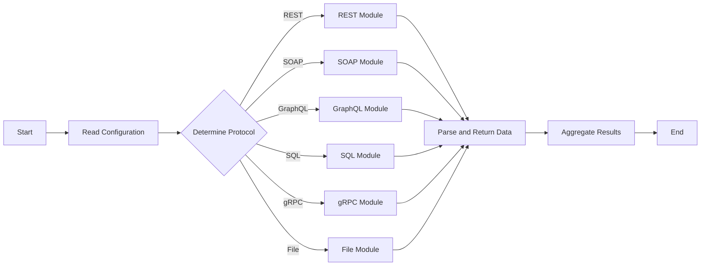

<p align="center">
    
</p>

# Orion

## Project Description

Prometheus is renowned for its robust service discovery capabilities, but complexities arise when dealing with resources that fall outside its native service discovery methods. This often necessitates the maintenance of static configuration files, a process that can be cumbersome and error-prone. Orion  addresses this challenge by providing a versatile web server capable of serving a dynamically generated list of targets. These targets are formatted for seamless compatibility with Prometheus, specifically utilizing the `http_sd_configs` configuration.

`Orion` is an advanced web server engineered to streamline the configuration and management of Prometheus targets. It adeptly handles queries across a diverse range of data sources, utilizing various protocols such as REST API, SOAP, GraphQL, SQL, gRPC, and file-based scraping. The system stands out for its high modularity; each protocol is managed by a dedicated module, ensuring seamless integration and consistent handling.

Orion's design philosophy emphasizes extensibility and adaptability. It allows for the creation and integration of custom modules, enabling users to tailor the system for retrieving targets from a wide array of data sources. This flexibility makes Orion an invaluable tool for organizations looking to harness the full potential of Prometheus in a variety of complex and evolving technological landscapes.

## Key Features

- **Modular Design**: Separate modules for each data source type (REST, SOAP, GraphQL, etc.) and Prometheus target retrieval.
- **Common Interface**: A consistent interface across all modules for initialization, request handling, and response parsing.
- **Configurable**: Uses YAML, JSON, or TOML configuration files for defining query parameters and target settings.
- **Concurrent Execution**: Leverages Go's goroutines for concurrent query execution.
- **Extensible**: Easily adaptable to include new data source types and target retrieval methods.

## Usage

You can define a local configuration file or use the default one.

```bash
orion run --config /path/to/config/file
```

**Docker**:

Run Orion with Docker:

```bash
docker run -d -p 9981:9981 -v /path/to/config/file:/config.yaml ghcr.io/geekxflood/orion:latest /usr/local/bin/orion run --config /config.yaml
```


## Configuration

The configuration file is a list of targets with settings for different data sources and protocols.

### Configuration Structure

The configuration file supports an array of targets, each specifying the data source type and relevant settings.

```yaml
targets:
  - type: "REST"
    url: "http://example.com/api"
    method: "GET"
    headers: {}
    response_type: "json"
    parser_rules: {}
    timeout: "30s"
    retry_count: 3
    retry_interval: "1s"

  - type: "File"
    file_path: "/path/to/local/file.json"
    file_format: "json"

module: "module_name"
port: "9981"
insecure: false
interval: "5s"
```

Each target can have protocol-specific parameters such as URLs for REST, file paths for file-based scraping, and endpoints for SOAP. Additionally, common parameters like response type and parsing rules can be specified.

### System Architecture

The system determines the protocol for each target based on the configuration and handles the requests using the appropriate module.



## Endpoints

- **/targets**: Returns a list of targets in JSON format compliant with Prometheus `http_sd_configs`.
- **/config**: Returns the configuration file in JSON format.

## Service Discovery with Prometheus

Orion acts as an `http_sd_configs` provider for Prometheus, allowing it to discover new targets automatically.

## Project Objectives

- Build a fast and reliable `http_sd_configs` provider for Prometheus.
- Ensure high availability and support for multiple-instance deployment.
- Cache and refresh data at regular intervals.

## Improvement Plans

- Extend configuration options to support various modules and features.
- Implement additional modules for different data querying protocols.
- Enhance caching, logging, and health check capabilities.
