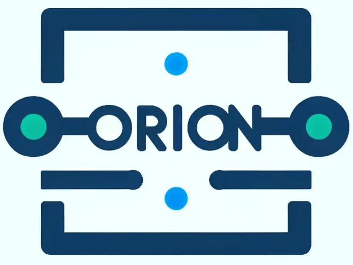

<h1 align="center" style="border-bottom: none">
    <a href="https://github.com/geekxflood/orion" target="_blank"></a>
</h1>

# Orion

## Table of Contents

<!-- TOC -->
- [Orion](#orion)
  - [Table of Contents](#table-of-contents)
  - [Project Description](#project-description)
  - [Key Features](#key-features)
  - [Endpoints](#endpoints)
  - [Configuration](#configuration)
    - [Module Configuration](#module-configuration)
  - [Usages](#usages)
    - [Initialize Configuration](#initialize-configuration)
    - [Start Orion](#start-orion)
      - [CLI](#cli)
      - [Docker](#docker)
- [License](#license)
<!-- TOC -->

## Project Description

Prometheus is renowned for its robust service discovery capabilities, but complexities arise when dealing with
resources that fall outside its native service discovery methods. This often necessitates the maintenance of static
configuration files, a process that can be cumbersome and error-prone. Orion  addresses this challenge by providing
a versatile web server capable of serving a dynamically generated list of targets. These targets are formatted for
seamless compatibility with Prometheus, specifically utilizing the `http_sd_configs` configuration.

`Orion` is an advanced web server engineered to streamline the configuration and management of Prometheus targets. It
adeptly handles queries across a diverse range of data sources, utilizing various protocols such as REST API, SOAP,
GraphQL, SQL, gRPC, and file-based scraping. The system stands out for its high modularity; each protocol is managed
by a dedicated module, ensuring seamless integration and consistent handling.

Orion's design philosophy emphasizes extensibility and adaptability. It allows for the creation and integration of 
custom modules, enabling users to tailor the system for retrieving targets from a wide array of data sources. 
This flexibility makes Orion an invaluable tool for organizations looking to harness the full potential of Prometheus 
in a variety of complex and evolving technological landscapes.

## Key Features

- **Modular Design**: Separate modules for each data source type (REST, SOAP, GraphQL, ...) and Prometheus target retrieval.
- **Configurable**: Uses YAML, JSON, or TOML configuration files for defining query parameters and target settings.

## Endpoints

- **/targets**: Returns a list of targets in JSON format compliant with Prometheus `http_sd_configs`.
- **/config**: Returns the configuration file in JSON format.

## Configuration

The configuration is design in a modular fashion, where you can define the data source and the target configuration.

### Module Configuration

When defining a target, you can specify the module to use for querying the data source. 
When default value are define for the module, the field become optional and a fallback to the default value.

- [File](doc/file.md)
- [REST](doc/rest.md)

## Usages

You can define a local configuration file or use the default one.

### Initialize Configuration

Initialize a new configuration file. The command will create a new configuration file in the `$HOME/.orion` directory.

```bash
orion init
```

### Start Orion

#### CLI

Run Orion through the CLI:

```bash
orion run --config /path/to/config/file
```

#### Docker

Run Orion with Docker:

```bash
docker run -d -p 9981:9981 -v /path/to/config/file:/config.yaml ghcr.io/geekxflood/orion:latest /usr/local/bin/orion run --config /config.yaml
```

# License

GNU GENERAL PUBLIC LICENSE v2.0 - [LICENSE](LICENSE)
